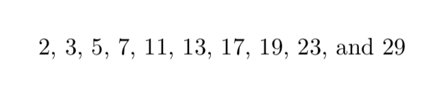
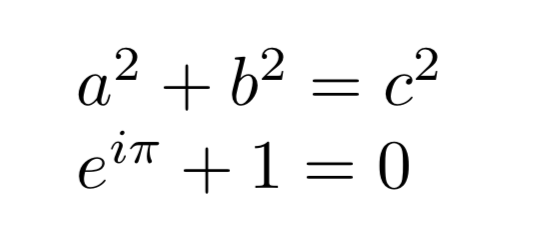

# XymosTeX [](https://travis-ci.com/xymostech/XymosTeX) [](https://coveralls.io/github/xymostech/XymosTeX?branch=master)

This project is an attempt to build an implementation of TeX in Rust. The overall goals of this project are:

1. Be a complete TeX implementation (see [more info about the goals](goals.md) for a detailed discussion of what this means)
2. Personally, to learn more intrinsically how TeX works by reading the TeXbook and trying things instead of by just reading the TeX source
3. Allow for better debugging of TeX (especially w.r.t. macro expansion) to provide helpful information for other TeX-like projects like [KaTeX](https://github.com/KaTeX/KaTeX).

## Status

Currently, XymosTeX has reached the point where is it Turing complete (that is, it implements things like macro expansion, conditionals, assignments), can interpret basic horizontal and vertical boxes, can interpret basic math experssions, and can generate a DVI file with the result.

The next body of work will be performing paragraph breaking and page breaking.

## Trying it

Because XymosTeX is under development, the best way to try it is to clone the repo and build it from in there.

XymosTeX produces [DVI files](https://en.wikipedia.org/wiki/Device_independent_file_format) as output, so something like dvipdf from another TeX system is needed to actually view the result.

```
$ git clone https://github.com/xymostech/XymosTeX.git
$ cd XymosTeX
$ cargo run
\def\hello #1{Hello, #1!}
\hello{World}
\end
$ dvipdf texput.dvi
$ open texput.pdf
```


One fun and impressive thing that XymosTeX can do is calculate primes for you:

```
$ cargo run --release < examples/primes.tex
$ dvipdf texput.dvi
$ open texput.pdf
```



XymosTeX can also render some math expressions, with a little help defining the
symbols:

```
$ cargo run --release < examples/basicmath.tex
$ dvipdf texput.dvi
$ open texput.pdf
```



## Contributing

I'm not currently taking feature contributions to XymosTeX since the goal is really for me to learn how TeX works for myself. However, since I am a Rust newbie, I am welcome to feedback about my Rust style and any suggestions about how to improve the code or repo structure.

## License

XymosTeX is licensed under the [MIT License](LICENSE)
